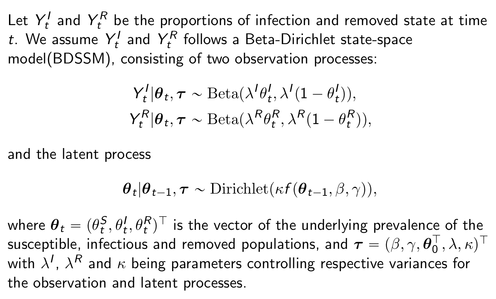
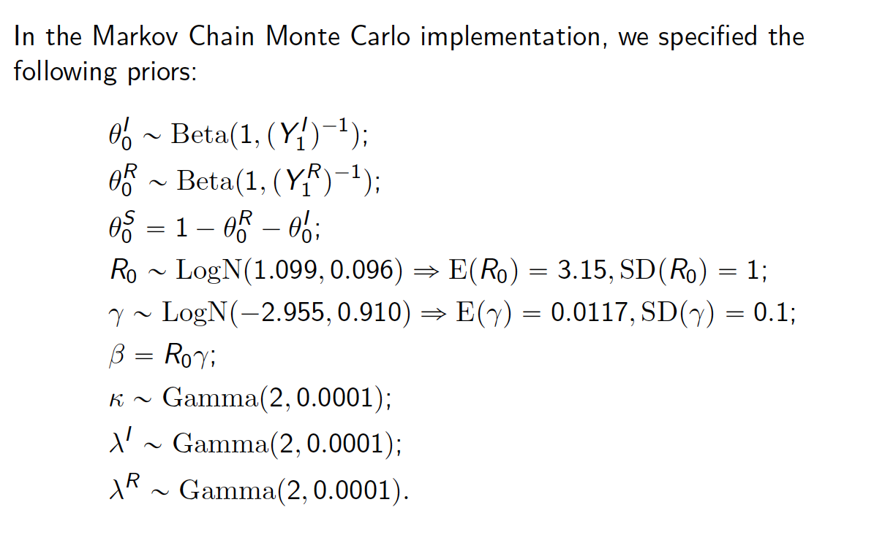
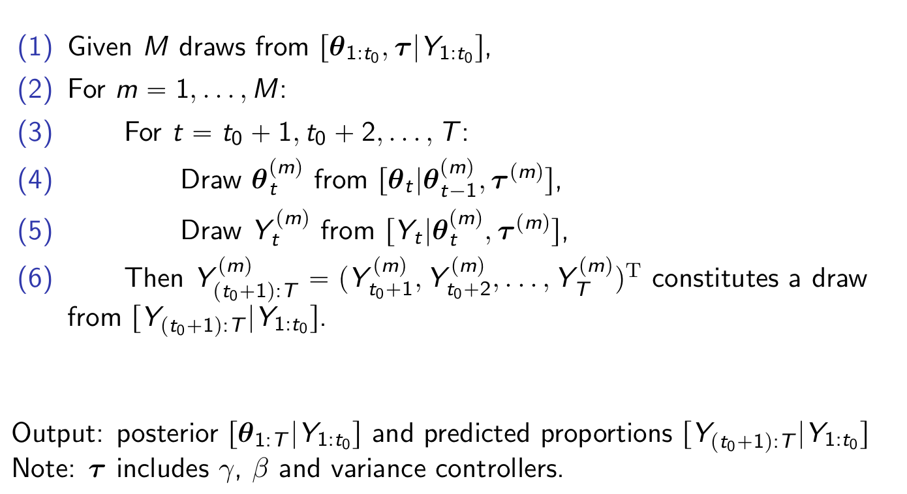
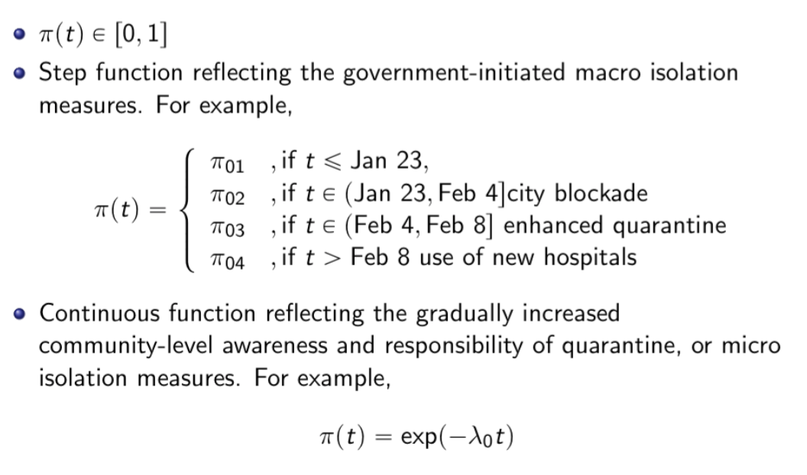
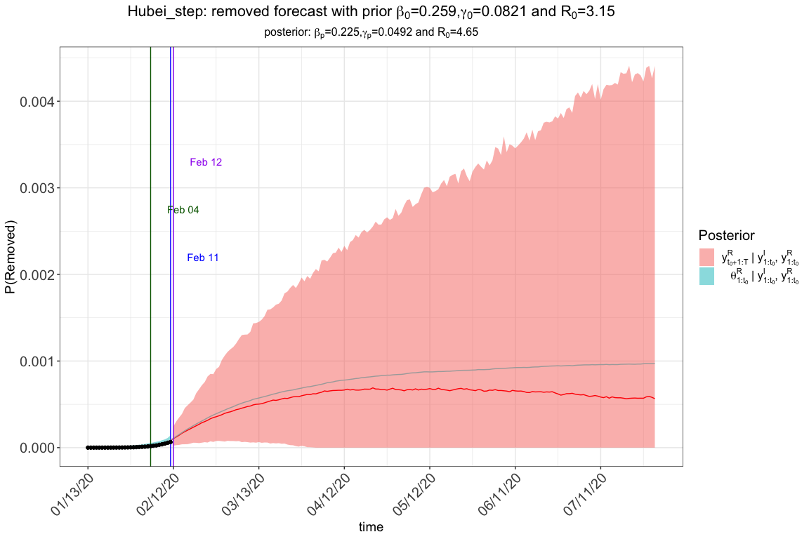
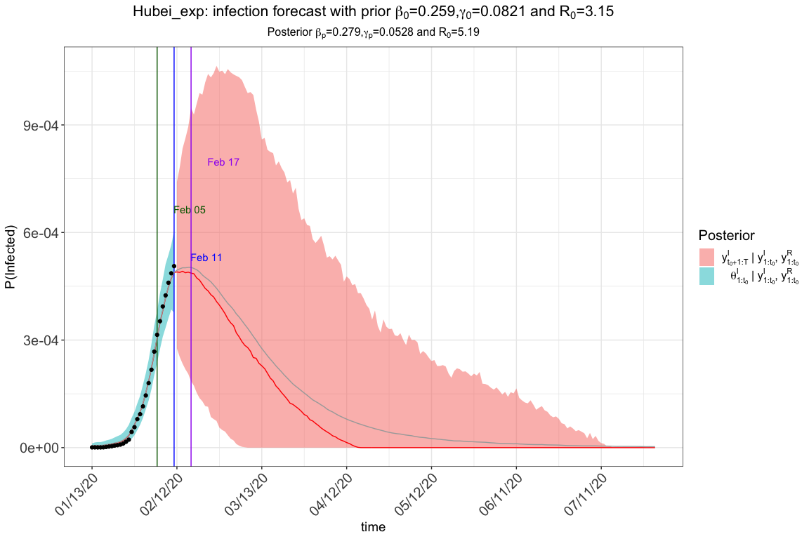
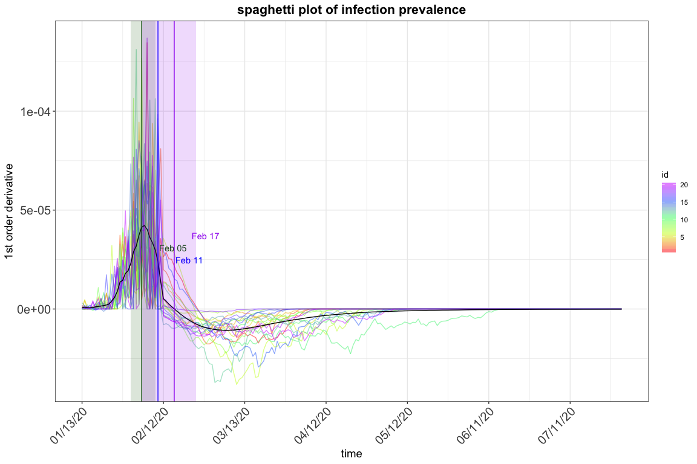
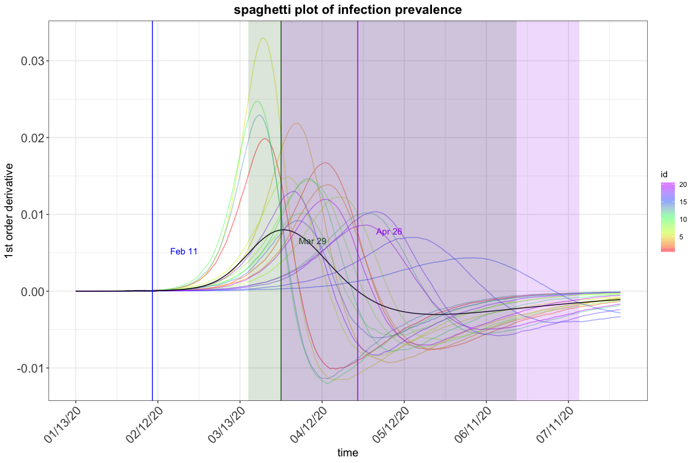

R包eSIR：扩展的状态空间SIR流行病学模型
================
[Song Lab](http://www.umich.edu/~songlab/)
2020-03-05

英文版本: [English](https://github.com/lilywang1988/eSIR/blob/master/README.md)

目的
-------

起源于湖北省省会武汉市的新型冠状病毒病（又名COVID-19）的爆发迅速蔓延，并影响了中国许多城市以及世界许多国家。中国政府已经实施了非常严格的检疫和检查，以防止COVID-19的传播恶化。尽管在媒体上已经发布了关于湖北省内外流行病拐点的各种形式的预测，但是没有一个预测模型明确说明了时变隔离协议。通过将医学隔离形式（家庭隔离和住院）纳入基本的传染病动态系统，我们扩展了传染病的经典SIR模型。使用针对每日感染和住院发病率的状态空间模型以及MCMC算法，我们评估了隔离方案对限制湖北省和中国其他地区传播的COVID-19的有效性。在给定的隔离协议下，可以从扩展的SIR获取预测的转折点及其可信带。 R软件包也向感兴趣的用户公开提供。

标准SIR模型包含三个组件：易感，受感染和已删除（包括恢复和死亡）。在以下各节中，我们将在包中介绍其他扩展状态空间SIR模型及其实现。 **以下提供的结果基于相对较短的链。** 根据我们的经验，此设置 (`M=5e3` and `nburnin=2e3`) 应在趋势和转折点估计方面提供可接受的结果， 参数及其可信区间的估计值可能不准确。 因此，如果可能，我们建议使用“ M = 5e5”和“ nburnin = 2e5”来通过以下方式获得稳定的MCMC链 [`rjags`](https://cran.r-project.org/web/packages/rjags/index.html).









安装准备
-----------
[直接下载并安装](https://github.com/lilywang1988/eSIR/blob/master/install_binary)

如果要从Github安装和使用此R软件包，您需要首先安装R软件包`devtools`。 请取消注释代码以安装它们。 eSIR依赖于其他三个软件包：rjags（JAGS库的接口），chron和gtools，如果尚未安装，它们可以与eSIR一起安装。如果尚未安装JAGS-4.x.y.exe，可能会发生错误。(for any x &gt;= 0, y &gt;=0). **Windows** 用户可以从以下位置下载并安装JAGS [here](http://www.sourceforge.net/projects/mcmc-jags/files). **Mac** 用户可以按照以下步骤操作 [casallas/8411082](https://gist.github.com/casallas/8411082).


``` r
# install.packages("devtools")
# library(devtools)

#for information and covariance calculation; sample size computation using Hasegawa proposal
# install_github("lilywang1988/eSIR")
library(eSIR) 
```

我们的数据来自于丁香医生 [dxy.com](https://mama.dxy.com/outbreak/daily-of-nationwide-new?index=20200206&locationIds=999&from=todh5). 其他我们知道的数据源包括 [GuangchuangYu/nCov2019](https://github.com/GuangchuangYu/nCov2019) 和 [qingyuanzhao/2019-nCov-Data](https://github.com/qingyuanzhao/2019-nCov-Data).

``` r
# Data of COVID-19 can be found in the following R packages: 
# install_github("GuangchuangYu/nCov2019")
#library(nCov2019) 
# install_github("qingyuanzhao/2019-nCov-Data")
#library(2019-nCov-Data) 
```
在Ubuntu（18.04）Linux中，请先将R更新到一个版本 &gt;= 3.6 的版本. 您可能还需要在通过`install.packages("devtools")`安装 devtools 之前安装jags软件包，方法是 `sudo apt-get install jags`。

模型1 `tvt.eSIR()`: 具有时变传输速率的SIR模型
-----------------------------------------------------------------------------

我们引入一个可以影响 *β* 的时间函数 *π*(*t*)∈\[0, 1\]，我们可以描述一系列时变变化，这些变化是由外部变化（例如政府政策，保护措施和环境变化）或内部变化（例如病原体的变异和进化）引起的。

该函数可以是逐步的或指数的：




``` r
set.seed(20192020)
library(eSIR)
#> Loading required package: rjags
#> Loading required package: coda
#> Linked to JAGS 4.3.0
#> Loaded modules: basemod,bugs
#> Loading required package: scales
#> Loading required package: ggplot2
#> Loading required package: chron
#> Loading required package: gtools
#> Loading required package: data.table
# Hubei province data Jan13 -> Feb 11
# cumulative number of infected
NI_complete <- c( 41,41,41,45,62,131,200,270,375,444,549, 729,
                   1052,1423,2714,3554,4903,5806,7153,9074,11177,
                13522,16678,19665,22112,24953,27100,29631,31728,33366)
  RI_complete <- c(1,1,7,10,14,20,25,31,34,45,55,71,94,121,152,213,
                   252,345,417,561,650,811,1017,1261,1485,1917,2260,
                   2725,3284,3754)
  N=58.5e6
  R <- RI_complete/N
  Y <- NI_complete/N- R #Jan13->Feb 11
  ### Step function of pi(t)
  change_time <- c("01/23/2020","02/04/2020","02/08/2020")
  pi0<- c(1.0,0.9,0.5,0.1)
  res.step <-tvt.eSIR(Y,R,begin_str="01/13/2020",death_in_R = 0.4,T_fin=200,
            pi0=pi0,change_time=change_time,dic=T,casename="Hubei_step",
            save_files = T, save_mcmc=F,save_plot_data = F,M=5e3,nburnin = 2e3)
#> The follow-up is from 01/13/20 to 07/30/20 and the last observed date is 02/11/20.
#> Running for step-function pi(t)
#> Compiling model graph
#>    Resolving undeclared variables
#>    Allocating nodes
#> Graph information:
#>    Observed stochastic nodes: 60
#>    Unobserved stochastic nodes: 37
#>    Total graph size: 1873
#> 
#> Initializing model
  res.step$plot_infection
```


``` r
  res.step$plot_removed
```



``` r
  res.step$spaghetti_plot
```


``` r
  res.step$dic_val
#> Mean deviance:  -1262 
#> penalty 37.98 
#> Penalized deviance: -1224

  ### continuous exponential function of pi(t)
  res.exp <- tvt.eSIR(Y,R,begin_str="01/13/2020",death_in_R = 0.4,
                      T_fin=200,exponential=TRUE,dic=F,lambda0=0.05,
                     casename="Hubei_exp",save_files = F,save_mcmc=F,
                     save_plot_data = F,M=5e3,nburnin = 2e3)
#> The follow-up is from 01/13/20 to 07/30/20 and the last observed date is 02/11/20.
#> Running for exponential-function pi(t)
#> Compiling model graph
#>    Resolving undeclared variables
#>    Allocating nodes
#> Graph information:
#>    Observed stochastic nodes: 60
#>    Unobserved stochastic nodes: 37
#>    Total graph size: 1873
#> 
#> Initializing model
  res.exp$plot_infection
```



``` r
  res.exp$spaghetti_plot
```



``` r
  #res.exp$plot_removed

  ### without pi(t), the standard state-space SIR model without intervention
  res.nopi <- tvt.eSIR(Y,R,begin_str="01/13/2020",death_in_R = 0.4,T_fin=200,                              casename="Hubei_nopi",save_files = F,save_plot_data = F,
                       M=5e3,nburnin = 2e3)
#> The follow-up is from 01/13/20 to 07/30/20 and the last observed date is 02/11/20.
#> Running without pi(t)
#> Compiling model graph
#>    Resolving undeclared variables
#>    Allocating nodes
#> Graph information:
#>    Observed stochastic nodes: 60
#>    Unobserved stochastic nodes: 37
#>    Total graph size: 1873
#> 
#> Initializing model
  res.nopi$plot_infection
```


``` r
  res.nopi$spaghetti_plot
```



``` r
  #res.nopi$plot_removed
```

模型2 `qh.eSIR()`: 具有随时间变化的隔离的SIR，遵循Dirac Delta函数
-------------------------------------------------------------------------------------------------
通过引入向量`phi`及其对应的变化点`change_time`，我们引入了依赖于Dirac delta函数 *ϕ*<sub>*t*</sub> ∈ \[0, 1\]。换句话说，仅在`change_time`定义的时间点，我们才将某些风险（易感）对象的某些部分移至隔离阶段。 该模型与以前的时变传输模型的不同之处在于，我们不允许传输率发生变化，而只是让易感对象的比例降低。


``` r
set.seed(20192020)
NI_complete <- c( 41,41,41,45,62,131,200,270,375,444,549, 729,
                    1052,1423,2714,3554,4903,5806,7153,9074,11177,
                    13522,16678,19665,22112,24953,27100,29631,31728,33366)
  RI_complete <- c(1,1,7,10,14,20,25,31,34,45,55,71,94,121,152,213,
                   252,345,417,561,650,811,1017,1261,1485,1917,2260,
                   2725,3284,3754)
  N=58.5e6
  R <- RI_complete/N
  Y <- NI_complete/N- R #Jan13->Feb 11

  change_time <- c("01/23/2020","02/04/2020","02/08/2020")
  phi0 <- c(0.1,0.4,0.4)
  res.q <- qh.eSIR (Y,R,begin_str="01/13/2020",death_in_R = 0.4,
                    phi0=phi0,change_time=change_time,casename="Hubei_q",
                    save_files = T,save_mcmc = F,save_plot_data = F,
                    M=5e3,nburnin = 2e3)
#> The follow-up is from 01/13/20 to 07/30/20 and the last observed date is 02/11/20.
#> Running for qh.eSIR
#> Compiling model graph
#>    Resolving undeclared variables
#>    Allocating nodes
#> Graph information:
#>    Observed stochastic nodes: 60
#>    Unobserved stochastic nodes: 37
#>    Total graph size: 2676
#> 
#> Initializing model
  res.q$plot_infection
```


``` r
  #res.q$plot_removed

  #res.noq <- qh.eSIR (Y,R,begin_str="01/13/2020",death_in_R = 0.4,
  #                    T_fin=200,casename="Hubei_noq",
  #                    M=5e3,nburnin = 2e3)
  #res.noq$plot_infection
```
如果在`qh.eSIR`中设置`save_file = T`，除了traceplots和summary表之外，还将获得以下图表。 蓝色垂直线表示开始日期，而其他三个灰色线表示三个更改点。


结果和汇总表
-------------------------
要保存所有图（包括轨迹图）和汇总表，请设置`save_files = T`，并在可能的情况下通过设置`file_add="YOUR/FAVORITE/FOLDER"`提供位置。否则，轨迹图和其他中间图将不会保存，但是您仍然可以使用`res.step$forecast_infection`和`res.step$out_table`来找到它们。 此外，如果您有兴趣自己绘制图形，可以设置`save_mcmc = T`，以便所有MCMC图形也都保存在`.RData`文件中。

有关详细信息，请直接浏览我们的软件包。我们有准备完整的`.rd`文件，请使用`?(tvt.eSIR)`或`help(qh.eSIR)`查找它们。

参考文献
----------

1.  Osthus, D., Hickmann, K. S., Caragea, P. C., Higdon, D., & Del Valle, S. Y. (2017). Forecasting seasonal influenza with a state-space SIR model. The annals of applied statistics, 11(1), 202.

2.  Mkhatshwa, T., & Mummert, A. (2010). Modeling super-spreading events for infectious diseases: case study SARS. arXiv preprint arXiv:1007.0908.
